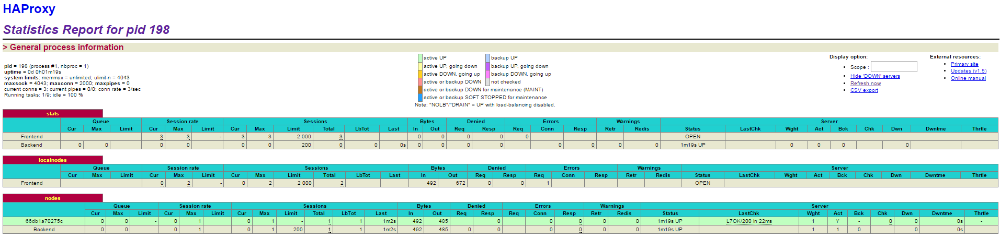
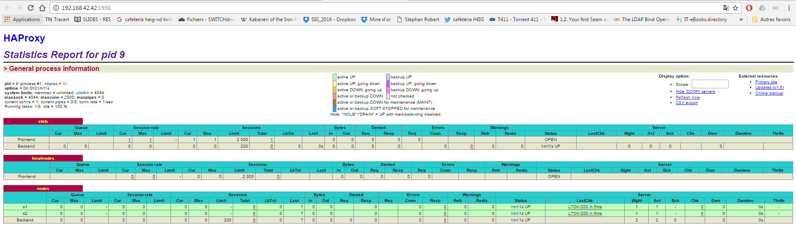
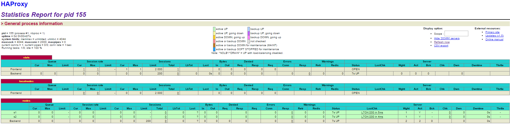
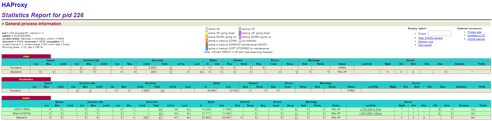
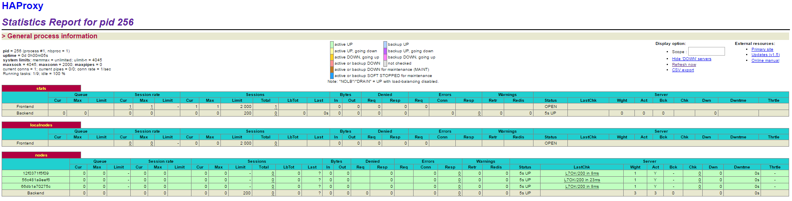
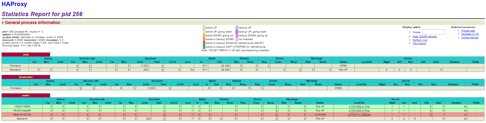
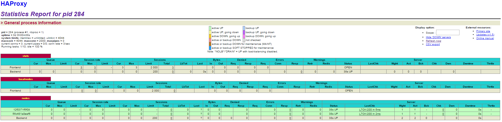

#AIT - Labo 04 - Virtualization
## ALBASINI Romain, SELIMI Dardan

##Introduction
This lab builds on a previous lab on load balancing. In this lab, we will go through one possible approach to manage a scalable infrastructure where we can add and remove nodes without having to rebuild the HAProxy image.
The initial configuration is the following : 

Both servers and the proxy are Docker containers. Requests will be simulated alternatively with different browsers accessing the 192.168.42.42 page. When accessing the URL, the proxy will decide which server is in charge for this request. 

Like we just mentioned, the goal is to implement a scalable infrastructure, looking like this : 

In order to do so, we will perform several tasks which details are explained in this report.

##Table of content
0. [Identify issues and install the tools](#task-0)
1. [Add a process supervisor to run several processes](#task-1)
2. [Add a tool to manage membership in the web server cluster](#task-2)
3. [React to membership changes](#task-3)
4. [Use a template engine to easily generate configuration files](#task-4)
5. [Generate a new load balancer configuration when membership changes](#task-5)
6. [Make the load balancer automatically reload the new configuration](#task-6)
7. [Difficulties](#difficulties)
8. [Conclusion](#conclusion)

## Task 0: Identify issues and install the tools	 

**Issues :**

1. [M1] Do you think we can use the current solution for a production environment? What are the main problems when deploying it in a production environment?

2. [M2] Describe what you need to do to add new webapp container to the infrastructure. Give the exact steps of what you have to do without modifiying the way the things are done. Hint: You probably have to modify some configuration and script files in a Docker image.

3. [M3] Based on your previous answers, you have detected some issues in the current solution. Now propose a better approach at a high level.

4. [M4] You probably noticed that the list of web application nodes is hardcoded in the load balancer configuration. How can we manage the web app nodes in a more dynamic fashion?

5. [M5] In the physical or virtual machines of a typical infrastructure we tend to have not only one main process (like the web server or the load balancer) running, but a few additional processes on the side to perform management tasks.
For example to monitor the distributed system as a whole it is common to collect in one centralized place all the logs produced by the different machines. Therefore we need a process running on each machine that will forward the logs to the central place. (We could also imagine a central tool that reaches out to each machine to gather the logs. That's a push vs. pull problem.) It is quite common to see a push mechanism used for this kind of task.
Do you think our current solution is able to run additional management processes beside the main web server / load balancer process in a container? If no, what is missing / required to reach the goal? If yes, how to proceed to run for example a log forwarding process?

6. [M6] In our current solution, although the load balancer configuration is changing dynamically, it doesn't follow dynamically the configuration of our distributed system when web servers are added or removed. If we take a closer look at the run.sh script, we see two calls to sed which will replace two lines in the haproxy.cfg configuration file just before we start haproxy. You clearly see that the configuration file has two lines and the script will replace these two lines.
What happens if we add more web server nodes? Do you think it is really dynamic? It's far away from being a dynamic configuration. Can you propose a solution to solve this?

**Deliverables**:

1. *Take a screenshot of the stats page of HAProxy at <http://192.168.42.42:1936>. You should see your backend nodes.*
   As expected, we can see both of our backend nodes running : 
   

2. *Give the URL of your repository URL in the lab report.*
TODO : URL

## Task 1: Add a process supervisor to run several processes

**Deliverables**:

1. *Take a screenshot of the stats page of HAProxy at <http://192.168.42.42:1936>. You should see your backend nodes. It should be really similar to the screenshot of the previous task.*
Indeed, the HAProxy's stats page is similar to the one seen in Task 0 : 

2. *Describe your difficulties for this task and your understanding of what is happening during this task. Explain in your own words why are we installing a process supervisor. Do not hesitate to do more research and to find more articles on that topic to illustrate the   problem.*
   TODO
   
## Task 2: Add a tool to manage membership in the web server cluster

**Deliverables**:

1. *Provide the docker log output for each of the containers: `ha`, `s1` and `s2`.*
   * ha log : [logs/task2/ha.log](../logs/task2/ha.log)
   * s1 log : [logs/task2/s1.log](../logs/task2/s1.log)
   * s2 log : [logs/task2/s2.log](../logs/task2/s2.log)

2. *Give the answer to the question about the existing problem with the current solution.*
TODO

3. *Give an explanation on how `Serf` is working. Read the official website to get more details about the `GOSSIP` protocol used in `Serf`. Try to find other solutions that can be used to solve similar situations where we need some auto-discovery mechanism.*
   
## Task 3: React to membership changes

**Deliverables**:

1. *Provide the docker log output for each of the containers:  `ha`, `s1` and `s2`.*
* We first start `ha` (log : [logs/task3/ha1.log](../logs/task3/ha1.log))
* Then, we start one of the nodes (s1 in our case) (log : [logs/task3/s11.log](../logs/task3/s1.log))
* Giving us to following log for `ha`: [logs/task3/ha12.log](../logs/task3/ha12.log)

2. *Provide the logs from the `ha` container gathered directly from the `/var/log/serf.log` file present in the container.*
* serf log : [logs/task3/serf.log](../logs/task3/serf.log)

## Task 4: Use a template engine to easily generate configuration files

**Deliverables**:

1. *You probably noticed when we added `xz-utils`, we have to rebuild the whole image which took some time. What can we do to mitigate that?*
TODO
To mitigate that, we could

 *Tell us about the pros and cons to merge as much as possible of the command.*
* Pros : 
* Cons : 

 *There are also some articles about techniques to reduce the image size. Try to find them. They are talking about `squashing` or `flattening` images.*

2. *Propose a different approach to architecture our images to be able to reuse as much as possible what we have done. Your proposition should also try to avoid as much as possible repetitions between your images.*

3. *Provide the `/tmp/haproxy.cfg` file generated in the `ha` container after each step.  Place the output into the `logs` folder like you already did for the Docker logs in the previous tasks. Three files are expected. In addition, provide a log file containing the output of the `docker ps` console and another file (per container) with `docker inspect <container>`. Four files are expected.*
   * haproxy.cfg after starting ha : [logs/task4/haproxy_1.log](../logs/task4/haproxy_1.log)
   * haproxy.cfg after starting s1 : [logs/task4/haproxy_2.log](../logs/task4/haproxy_2.log)
   * haproxy.cfg after starting s2 : [logs/task4/haproxy_3.log](../logs/task4/haproxy_3.log)
   * Output of `docker ps` : [logs/task4/docker_ps.log](../logs/task4/docker_ps.log)
   * Output of `docker inspect ha` : [logs/task4/inspect_ha.log](../logs/task4/inspect_ha.log)
   * Output of `docker inspect s1` : [logs/task4/inspect_s1.log](../logs/task4/inspect_s1.log)
   * Output of `docker inspect ha` : [logs/task4/inspect_s2.log](../logs/task4/inspect_s2.log)
    
4. *Based on the three output files you have collected, what can you say about the way we generate it? What is the problem if any?*
   
## Task 5: Generate a new load balancer configuration when membership changes
asdf

**Deliverables**:

1. *Provide the file `/usr/local/etc/haproxy/haproxy.cfg` generated in the `ha` container after each step. Three files are expected. In addition, provide a log file containing the output of the `docker ps` console and another file (per container) with `docker inspect <container>`. Four files are expected.*
   * haproxy.cfg after starting ha : [logs/task5/haproxy_1.cfg](../logs/task5/haproxy_1.cfg)
   * haproxy.cfg after starting s1 : [logs/task5/haproxy_2.cfg](../logs/task5/haproxy_2.cfg)
   * haproxy.cfg after starting s2 : [logs/task5/haproxy_3.cfg](../logs/task5/haproxy_3.cfg)
   * Output of `docker ps`: [logs/task5/docker_ps.log](../logs/task5/docker_ps.log)
   * Output of `docker inspect ha`: [logs/task5/inspect_ha.log](../logs/task5/inspect_ha.log)
   * Output of `docker inspect s1`: [logs/task5/inspect_s1.log](../logs/task5/inspect_s1.log)
   * Output of `docker inspect ha`: [logs/task5/inspect_s2.log](../logs/task5/inspect_s2.log)
  
2. *Provide the list of files from the `/nodes` folder inside the `ha` container. One file expected with the command output.*
   * List of files from `/nodes`: [logs/task5/ls_nodes.log](../logs/task5/ls_nodes.log)

3. *Provide the configuration file after you stopped one container and the list of nodes present in the `/nodes` folder. One file expected with the command output. Two files are expected. In addition, provide a log file containing the output of the    `docker ps` console. One file expected.*
   * haproxy.cfg after stopping s1 : [logs/task5/haproxy_4.cfg](../logs/task5/haproxy_2.cfg)
   * List of files from `/nodes`: [logs/task5/ls_nodes2.log](../logs/task5/ls_nodes2.log)
   * Output of `docker ps`: [logs/task5/docker_ps2.log](../logs/task5/docker_ps2.log)
   
## Task 6: Make the load balancer automatically reload the new configuration

**Deliverables**:

1. *Take a screenshots of the HAProxy stat page showing more than 2 web applications running. Additional screenshots are welcome to see a sequence of experimentations like shutting down a node and starting more nodes. Also provide the output of `docker ps` in a log file. At least one file is expected. You can provide one output per step of your experimentation according to your screenshots.*
* We first ran `ha` and `s1`. As expected, HAProxy's stat page shows only one application running : 

`docker ps` output : [logs/task6/6.1_ps.log](../logs/task6/6.1_ps.log)

* We then ran `s2`. As expected, HAProxy's stat page now shows both applications running : 

`docker ps` output : [logs/task6/6.2_ps.log](../logs/task6/6.2_ps.log)
* We now ran a third node `s3`. HAProxy's stat page now shows the 3 applications running : 

`docker ps` output : [logs/task6/6.3_ps.log](../logs/task6/6.3_ps.log)
* Finally, we stopped `s1`. HAProxy's stat page then shows s1 as stopped : 

and after a few seconds deletes it : 

`docker ps` output : [logs/task6/6.4ps.log](../logs/task6/6.4_ps.log)
   
2. *Give your own feelings about the final solution. Propose improvements or ways to do the things differently. If any, provide references to your readings for the improvements.*
   
## Difficulties

## Conclusion
